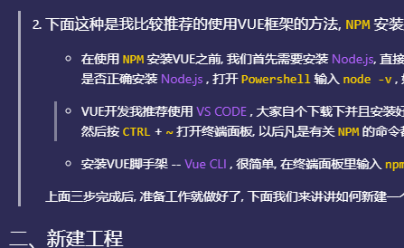

# 🤘**VUE入门手册**🤘
---
## 一、安装
VUE框架的安装主要有两种方式:
1. **一种是将VUE当作普通的JS插件使用, 直接用 `<script>` 引入;**
    ```html
    <script src="https://cdn.jsdelivr.net/npm/vue/dist/vue.js"></script>
    ```
    这样的引用方法可以很方便的使用vue的基本功能, 缺点是没法在IE浏览器上预览, 如果对自己CSS兼容写法有信心的同学可以用这个方法;😎
1. **下面这种是我比较推荐的使用VUE框架的方法, `NPM` 安装;**
    - 在使用 `NPM` 安装VUE之前, 我们首先需要安装 [Node.js](https://nodejs.org/en/), 直接按照默认的设置一路安装完就行. 
    安装完后需要检查下是否正确安装 [Node.js](https://nodejs.org/en/) , 打开 `Powershell` 输入 `node -v` , 如果输出版本号的话 , 就说明安装成功了;

    - VUE开发我推荐使用 [VS CODE](https://code.visualstudio.com/) , 大家自个下载下并且安装好, 安装好后按 `CTRL + K` + `CTRL + O` 打开一个文件夹, 然后按 `CTRL` + `~` 打开终端面板, 以后凡是有关 `NPM` 的命令都可以直接在这里输入;

    - 安装VUE脚手架 -- [Vue CLI](https://cli.vuejs.org/) , 很简单, 在终端面板里输入 `npm install -g @vue/cli` 即可;
  
    **上面三步完成后, 准备工作就做好了, 下面我们来讲讲如何新建一个工程.👇** 


## 二、新建工程


## 三、在本机上运行工程

## 四、和开发对接注意事项

## 五、如何引入第三方插件

## 六、方便VUE切图的小工具